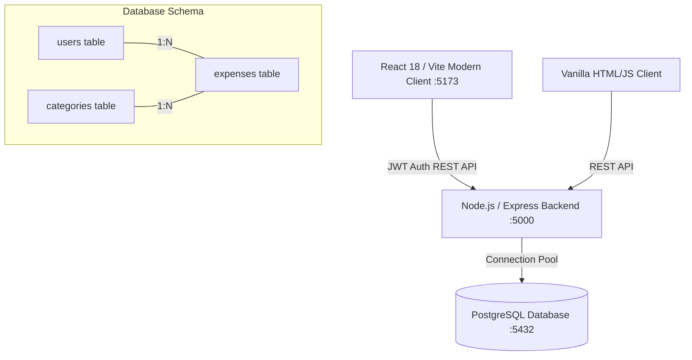

# 💰 College Student Expense Tracker & Financial Intelligence System

[](https://react.dev/)
[](https://nodejs.org/)
[](https://www.postgresql.org/)
[](https://tailwindcss.com/)
[](https://opensource.org/licenses/MIT)

A full-stack, enterprise-grade personal finance management web application tailored specifically for college students. Helps students track spending, manage monthly budgets, analyze expenditures across essential categories (Tuition, Food, Housing, Textbooks, Entertainment), and visualize spending trends with interactive charts.

---

## ✨ Key Features

- **🔐 Secure Authentication**: JWT (JSON Web Token) and bcrypt-powered session security with protected API routes.
- **📊 Modern React Dashboard (`frontend-modern`)**: Fast, responsive Vite single-page application featuring smooth transitions, glassmorphic dark-theme aesthetics, and real-time expense filtering.
- **📈 Interactive Analytics & Visualizations**: Category breakdown pie charts, monthly burn-rate bar graphs, and spending history trends.
- **🏷️ Student-Centric Categorization**: Pre-seeded database categories tuned for college life:
  - 🍕 Food & Groceries
  - 📚 Textbooks & Supplies
  - 🎓 Tuition & Fees
  - 🏠 Housing & Rent
  - 🎬 Entertainment & Social
  - 🚌 Commute & Transportation
- **⚡ Dual Frontend Architecture**:
  - `frontend-modern/`: Next-generation React 18 + Vite + Lucide Icons + Tailwind dashboard.
  - `frontend/`: Lightweight zero-dependency HTML5/CSS3/JavaScript interface for low-resource environments.
- **📑 SQL Architecture & Documentation**: Includes comprehensive relational schema (`database.sql`), ER presentation decks, and query explanations.

---

## 🏗️ Architecture



---

## 🚀 Getting Started

### 1. Prerequisites
- **Node.js** v18+ & **npm**
- **PostgreSQL** 14+ installed and running

---

### 2. Database Setup

1. Open your PostgreSQL terminal (`psql`) or pgAdmin:
   ```sql
   CREATE DATABASE expense_tracker;
   ```
2. Execute the schema script:
   ```bash
   psql -U postgres -d expense_tracker -f database.sql
   ```

---

### 3. Backend Setup

```bash
cd backend

# Install dependencies
npm install

# Configure environment variables (.env)
cat <<EOF > .env
PORT=5000
DB_HOST=localhost
DB_PORT=5432
DB_USER=postgres
DB_PASSWORD=your_postgres_password
DB_NAME=expense_tracker
JWT_SECRET=your_jwt_secret_key
EOF

# Start the Express API server
npm start
```
Backend will start on `http://localhost:5000`.

---

### 4. Modern Frontend Setup (Recommended)

```bash
cd frontend-modern

# Install dependencies
npm install

# Start the Vite development server
npm run dev
```
Open [http://localhost:5173](http://localhost:5173) in your browser.

---

## 📁 Repository Structure

```
expense-tracker/
├── backend/                  # Express REST API
│   ├── routes/               # Auth and Expense endpoints
│   ├── db.js                 # PostgreSQL pg-pool client
│   └── server.js             # Express application entrypoint
├── frontend-modern/          # Modern React 18 + Vite SPA
│   ├── src/                  # Components, Pages, State, Styles
│   └── vite.config.js        # Vite configuration
├── frontend/                 # Lightweight Vanilla HTML/JS frontend
├── database.sql              # Relational database schema & seed data
├── SQL_Presentation_Slides.md# SQL presentation deck
├── SQL_Queries_Explained.pptx# Relational architecture slides
└── README.md                 # Documentation
```

---

## 👤 Author

**Sanyam Sharma**
- GitHub: [@Sanyam961](https://github.com/Sanyam961)

---

## 📄 License

This project is licensed under the MIT License.
